# CoreBridge-MSA

> MSA 기반 채용 관리 플랫폼 — 13개 마이크로서비스 + 6가지 핵심 아키텍처 패턴

채용 프로세스의 공고 등록부터 지원, 면접 일정 관리, AI 매칭까지 전 과정을 관리하는 플랫폼입니다.
단순 CRUD가 아닌 **실무에서 마주치는 분산 시스템 문제를 직접 해결**하는 데 초점을 맞췄습니다.

---

## 🌐 Live Demo

**👉 [https://corebridge.cloud/home](https://corebridge.cloud/home)**

별도 설치 없이 위 링크에서 주요 기능을 바로 체험할 수 있습니다.
MSA 13개 서비스를 단일 Spring Boot 앱으로 통합한 데모 버전입니다.

| 역할 | 이메일 | 비밀번호 |
|------|--------|----------|
| 구직자 | user@demo.com | qwer1234 |
| 기업 | company@demo.com | qwer1234 |
| 관리자 | admin@demo.com | qwer1234 |

> 데모 소스코드: [CoreBridge-Demo](https://github.com/atimaby28/CoreBridge-Demo)

---

## 6가지 핵심 아키텍처 패턴

| 패턴 | 해결한 문제 | 기술 |
|------|-----------|------|
| **Outbox Pattern** | 서비스 간 데이터 일관성 (Dual Write 방지) | Outbox + Kafka (6 Topic, 5 Outbox Producer) |
| **Circuit Breaker** | 장애 전파 차단 (Cascading Failure) | Resilience4j (5개 독립 인스턴스) |
| **CQRS + Batch** | 읽기 성능 최적화 | ConcurrentHashMap 캐시 + Kafka 이벤트 동기화 |
| **AI Pipeline** | LLM 80초 블로킹 → 스레드 풀 고갈 | FastAPI + Ollama + n8n 비동기 (99.7% 응답시간 단축) |
| **API Gateway** | 13개 서비스 인증 중복 제거 + 트래픽 보호 | Spring Cloud Gateway + Cookie JWT 중앙 검증 + Redis Rate Limiter |
| **K8s + CI/CD** | 배포 자동화 | K3s + Jenkins + Rolling Update |

---

## 기술 스택

**Backend**: Java 21, Spring Boot 3.4, Spring Cloud Gateway, JPA/Hibernate, Resilience4j

**Frontend**: Vue.js 3, TypeScript, Pinia, Tailwind CSS, Vite

**AI**: Python, FastAPI, Ollama (llama3 + nomic-embed-text), Redis Vector Search, n8n

**Infra**: PostgreSQL 18, Apache Kafka, Redis Stack, Docker, K3s, Jenkins, Prometheus, Grafana

**트래픽 대응**: Redis (SADD 원자적 중복 체크 + Rate Limiter) + Kafka (쓰기 버퍼링)

---

## 📸 스크린샷

### 👤 구직자
| 대시보드 | 채용공고 목록 | 채용공고 상세 |
|:-:|:-:|:-:|
| 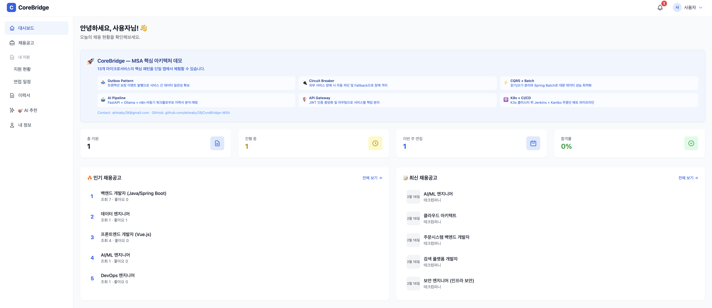 | 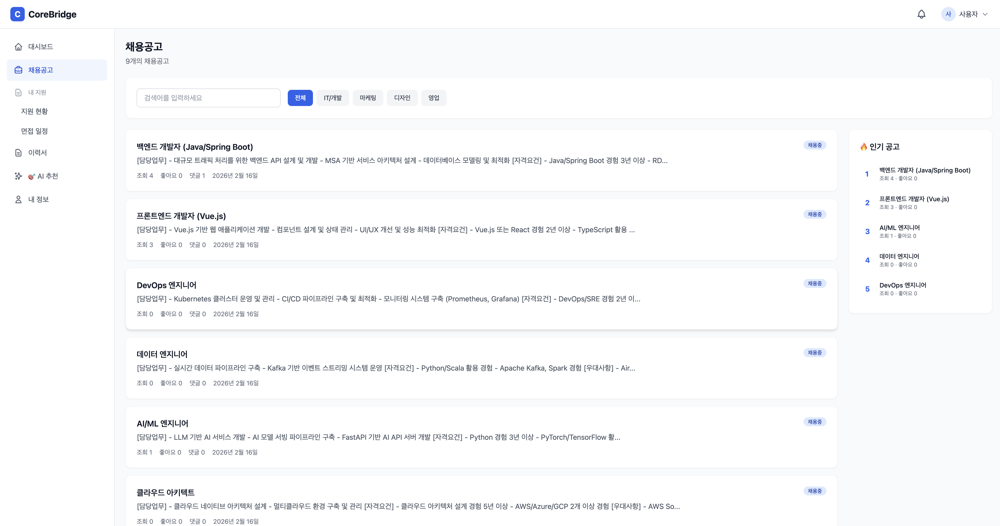 | 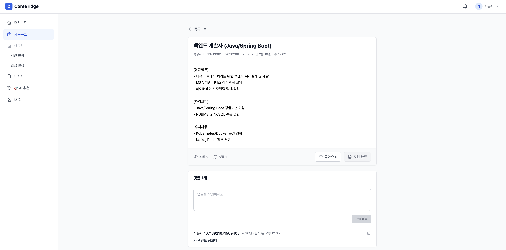 |

| 이력서 + AI 분석 | 채용공고 지원 | 알림 |
|:-:|:-:|:-:|
| 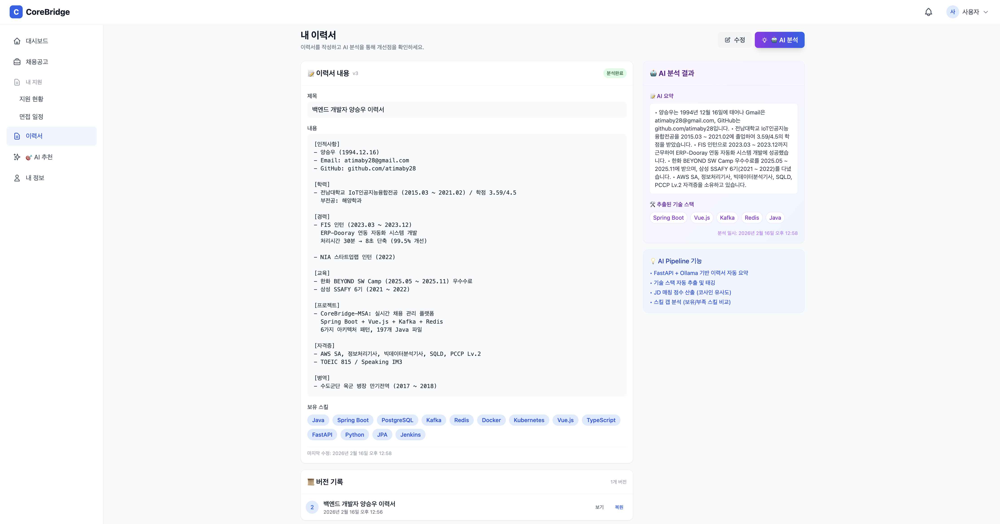 | 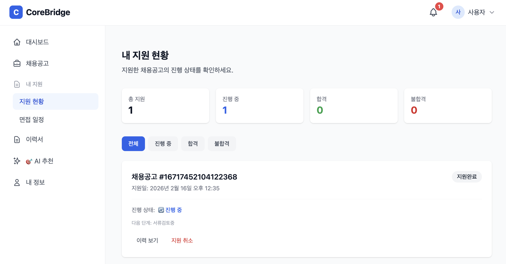 | 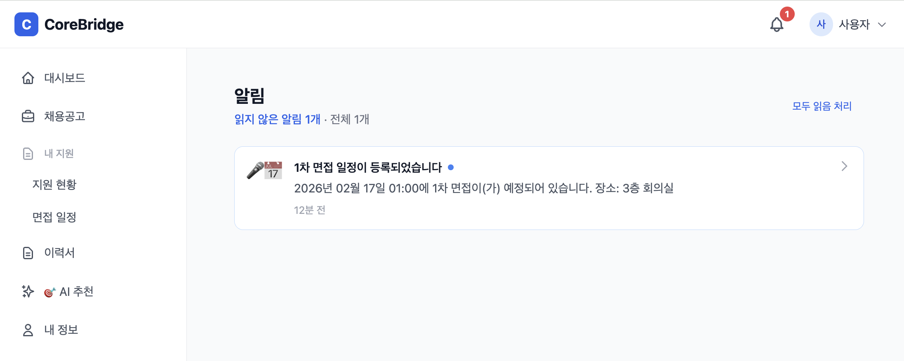 |

### 🏢 기업
| 대시보드 | 지원자 관리 (리스트) | 지원자 관리 (칸반보드) |
|:-:|:-:|:-:|
| 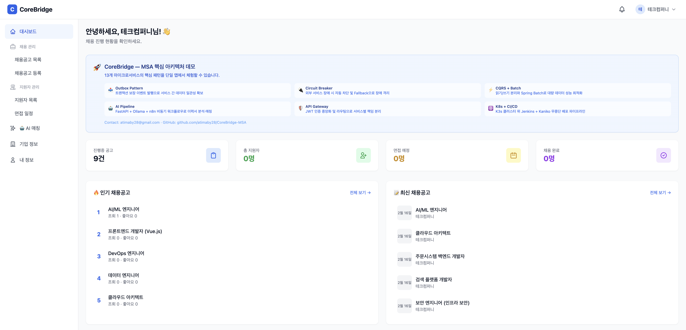 | 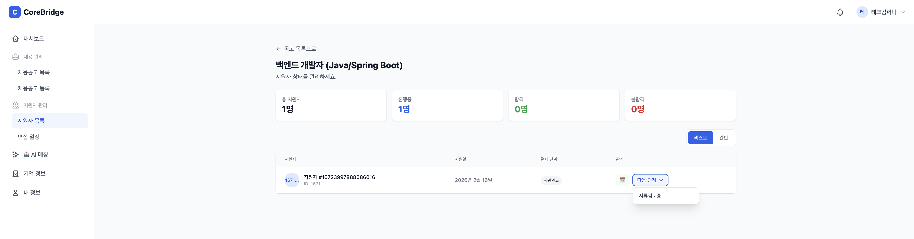 | 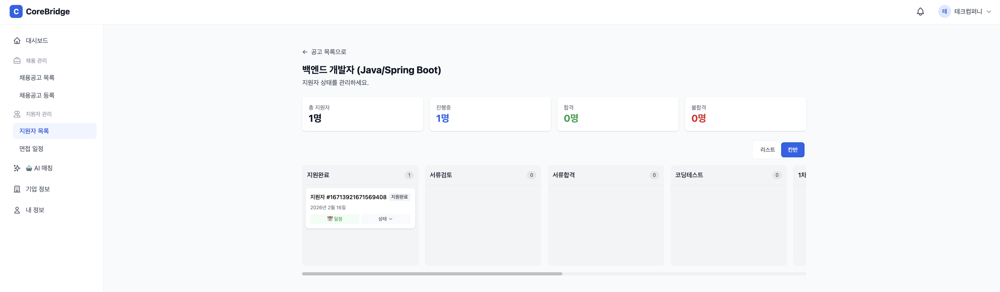 |

| AI 이력서 매칭 | 면접 일정 (리스트) | 면접 일정 (캘린더) |
|:-:|:-:|:-:|
| 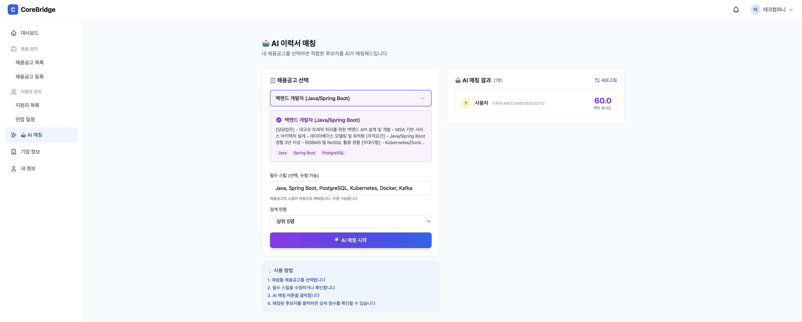 | 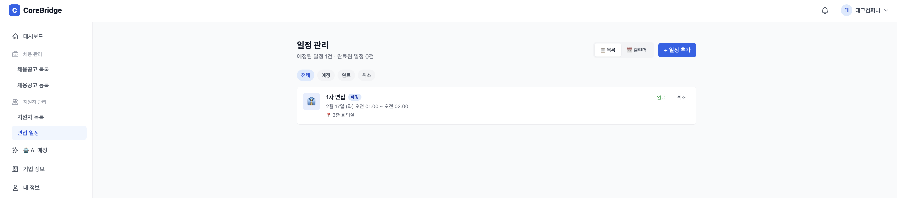 | 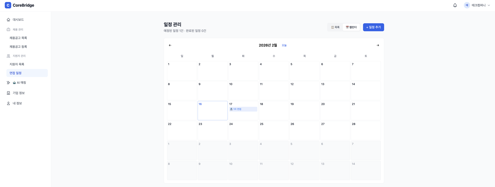 |

### 🔧 관리자
| 사용자 관리 | 사용자 통계 | 감사 로그 |
|:-:|:-:|:-:|
| 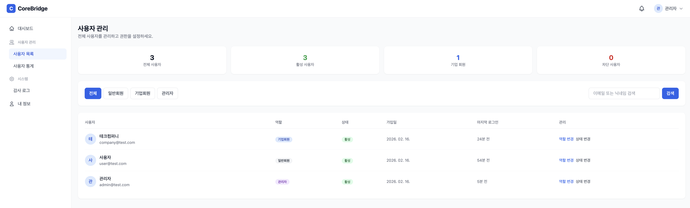 | 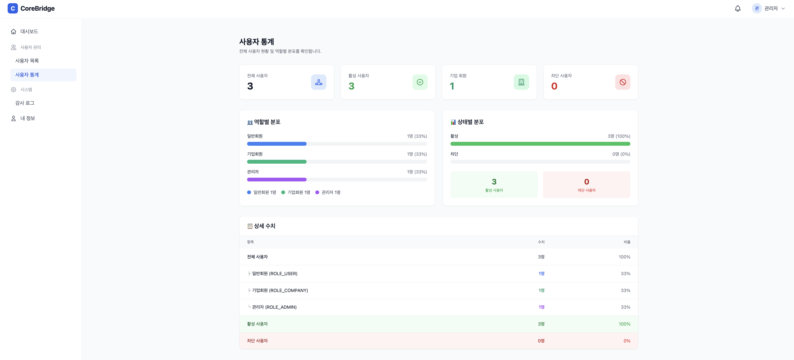 | 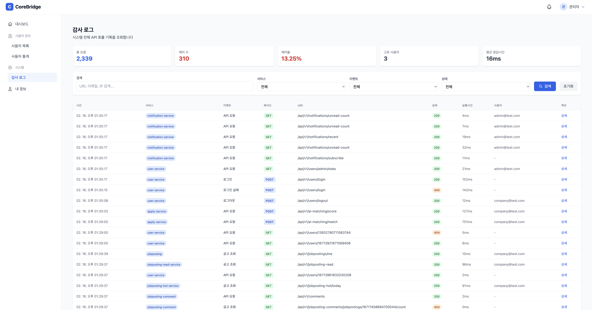 |

---

## 서비스 구성

```
Frontend (Vue.js :5173)
    ↓
API Gateway (:8000)  ─── JWT 중앙 검증, 라우팅, Rate Limiter (Redis Token Bucket)
    ↓
┌─────────────────────────────────────────────────────────────┐
│  user         :8001   사용자/인증/JWT 발급                   │
│  jobposting   :8002   채용공고 CRUD (Outbox 생산자)           │
│  comment      :8003   댓글 (Outbox 생산자)                   │
│  view         :8004   조회수 (Outbox 생산자)                  │
│  like         :8005   좋아요 (Outbox 생산자)                  │
│  hot          :8006   인기 공고 집계 (Kafka 소비자)            │
│  read         :8007   CQRS 읽기 모델 (Kafka 소비자)           │
│  resume       :8008   이력서 관리 + AI 분석 연동               │
│  apply        :8009   지원/채용프로세스/AI 매칭                │
│                       (Redis 중복체크 + Kafka 비동기 쓰기 버퍼) │
│  notification :8010   알림 (SSE + Redis Pub/Sub)             │
│  schedule     :8011   면접 일정 관리                          │
│  admin-audit  :8012   관리자 감사 로그                        │
└─────────────────────────────────────────────────────────────┘
    ↓                        ↓
  Kafka (6 Topics)       AI Pipeline
  Outbox → Consumer      FastAPI :9001 + Ollama :11434 + n8n :5678
  Apply → Consumer
```

### 대규모 동시 지원 처리 구조

채용 공고 마감 직전 수천~만 명의 동시 지원 트래픽을 안정적으로 처리합니다.

```
[유저 1만 명 동시 지원]
        ↓
Gateway Rate Limiter (초당 200건 초과 → 429 차단)
        ↓
Apply Service — Redis SADD (원자적 중복 체크, O(1))
        ↓
Kafka "corebridge-apply" 토픽에 발행 (DB 접근 없음)
        ↓
즉시 응답: "접수되었습니다" (50ms 이내)

======= 유저 대기 끝 =======

ApplyEventConsumer가 Kafka에서 메시지를 자기 속도로 소비
        ↓
DB INSERT (Apply + RecruitmentProcess)
        ↓
SSE 알림: "지원이 확정되었습니다"
```

---

## 빠른 시작

### 사전 요구사항

- Docker & Docker Compose
- Java 21+ (백엔드 빌드용)
- Node.js 18+ (프론트엔드 빌드용)

### 1. 인프라 실행

```bash
# PostgreSQL, Redis, Kafka 실행 (init-db.sql → 12개 DB 자동 생성)
docker-compose up -d

# 볼륨 초기화 후 재시작하려면:
# docker-compose down -v && docker-compose up -d
```

### 2. 백엔드 실행

```bash
cd backend
./gradlew build -x test

# 각 서비스 개별 실행 (멀티 터미널 또는 IDE Run Configuration)
# 시작 시 DataInitializer가 시드 데이터를 자동 생성합니다
java -jar service/gateway/build/libs/*.jar
java -jar service/user/build/libs/*.jar        # → admin, company, user1 계정 생성
java -jar service/jobposting/build/libs/*.jar  # → 채용공고 5개 생성
java -jar service/resume/build/libs/*.jar      # → 이력서 1개 생성
# ... (나머지 서비스)
```

### 3. 프론트엔드 실행

```bash
cd frontend
npm install
npm run dev
# → http://localhost:5173
```

### 4. AI Pipeline 실행 (선택)

```bash
# Ollama 설치 후
ollama pull llama3
ollama pull nomic-embed-text

cd ai
docker-compose up -d   # FastAPI + n8n
```

### 테스트 계정 (로컬)

| 역할 | 이메일 | 비밀번호 | 시드 데이터 |
|------|--------|---------|-----------:|
| 관리자 | admin@test.com | qwer1234 | - |
| 기업 | company@test.com | qwer1234 | 채용공고 5개 |
| 지원자 | user@test.com | qwer1234 | 이력서 1개 |

</br>

> 모든 시드 데이터는 각 서비스의 `DataInitializer`가 앱 시작 시 자동 생성합니다.</br>
> `init-db.sql`은 PostgreSQL 최초 실행 시 12개 데이터베이스만 생성합니다.

---

## 프로젝트 구조

```
CoreBridge-MSA/
├── backend/
│   ├── common/                  # 공통 모듈 (Outbox, Event, Snowflake, Security)
│   ├── service/
│   │   ├── gateway/             # API Gateway (Spring Cloud Gateway + Rate Limiter)
│   │   ├── user/                # 사용자 + JWT 인증
│   │   ├── jobposting/          # 채용공고 (Outbox 생산자)
│   │   ├── jobposting-comment/  # 댓글 (Outbox 생산자)
│   │   ├── jobposting-view/     # 조회수 (Outbox 생산자)
│   │   ├── jobposting-like/     # 좋아요 (Outbox 생산자)
│   │   ├── jobposting-read/     # CQRS 읽기 모델 + Circuit Breaker
│   │   ├── jobposting-hot/      # 인기 공고 집계
│   │   ├── resume/              # 이력서 + AI 분석 연동
│   │   ├── apply/               # 지원/채용프로세스/AI 매칭 (Redis + Kafka 비동기)
│   │   ├── notification/        # 알림 (SSE)
│   │   ├── schedule/            # 면접 일정
│   │   └── admin-audit/         # 감사 로그
│   └── build.gradle
├── frontend/                    # Vue.js 3 + TypeScript
├── ai/
│   └── fastapi/                 # AI API (임베딩, 매칭, 스코어링)
├── deploy/
│   ├── k3s/                     # Kubernetes 매니페스트
│   └── load-test/               # k6 부하 테스트 스크립트
├── docs/
│   ├── ARCHITECTURE.md           # 아키텍처 문서
│   ├── API.md                    # API 명세
│   ├── ERD.md                    # ERD 설계
│   ├── design/                   # 패턴별 설계 문서 (6개)
│   └── retrospective/            # 기술 회고 (4개)
├── scripts/
│   └── init-db.sql               # DB 생성 (시드 데이터는 DataInitializer)
└── docker-compose.yml            # 인프라 (PostgreSQL, Redis, Kafka)
```

---

## 문서

| 문서 | 설명 |
|------|------|
| [ARCHITECTURE.md](docs/ARCHITECTURE.md) | 전체 아키텍처, 포트 매핑, Kafka 토픽, AI 파이프라인 |
| [API.md](docs/API.md) | Gateway 기반 API 명세 (13개 서비스) |
| [ERD.md](docs/ERD.md) | 데이터베이스 설계 (Outbox, CQRS 포함) |
| [Outbox 설계문서](docs/design/) | 왜 Outbox을 선택하였을까? (CDC/Dual Write 비교) |
| [Circuit Breaker 설계문서](docs/design/) | 왜 Resilience4j를 적용하였을까? (파라미터 튜닝 근거) |
| [CQRS 설계문서](docs/design/) | 왜 ConcurrentHashMap인가? (Redis 대비) |
| [AI Pipeline 설계문서](docs/design/) | 왜 n8n 비동기를 사용했는가? (Spring @Async 대비) |
| [API Gateway 설계문서](docs/design/) | 왜 Cookie JWT인가? (XSS vs CSRF) |
| [K8s/CI/CD 설계문서](docs/design/) | 왜 K3s + Rolling Update인가? |

---

## 테스트

```bash
cd backend
./gradlew test
```

Java 240파일, 테스트 29개 파일 · 226개 메서드 (단위 + 통합)

---

## 개발 환경

- iMac M1 (2021) / 16GB RAM / macOS Sequoia 15.5
- IntelliJ IDEA / VS Code
- K3s on WSL2 (CI/CD 검증용)

---

## License

MIT License
